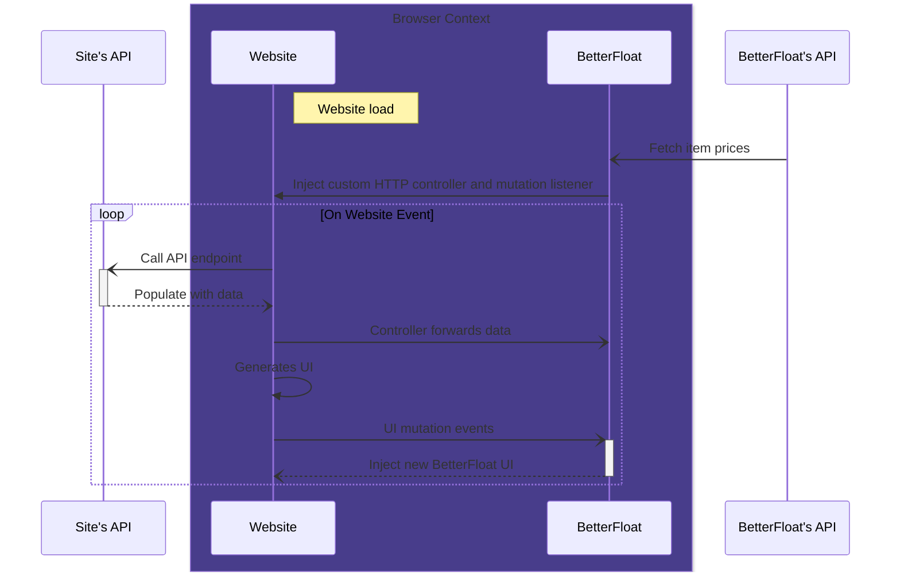

  
  <h1 align="center">BetterFloat</h1>

  <a href="https://chromewebstore.google.com/detail/betterfloat/bphfhlfhnohppnleaehnlfigkkccpglk">
    <picture>
      <source srcset="https://i.imgur.com/XBIE9pk.png" media="(prefers-color-scheme: dark)">
      </picture></a>
  <a href="https://addons.mozilla.org/en-US/firefox/addon/betterfloat/">
    <picture>
      <source srcset="https://i.imgur.com/ZluoP7T.png" media="(prefers-color-scheme: dark)">
      </picture></a>
    

## 🤝 Community / Support

We maintain a very active Discord server, where you can share your snipes, ask questions, report bugs, or suggest new features. Join here:

  <a href="https://discord.gg/VQWXp33nSW">
    <picture>
      <source srcset="https://i.postimg.cc/Fzj7T05w/discord.png" media="(prefers-color-scheme: dark)">
      </picture></a>

## 📄 Highlights

Currently supports CSFloat.com, Skinport.com and Skinbid.com, but more sites are coming soon!

-   Unified pricing from Buff163, Steam, YouPin/UU, C5Game, and CSFloat displayed right next to the item
-   Determine market overpay through applied sticker data (% SP) with gradual coloring
-   Get Case Hardened pattern data such as blue percentage or ranking directly
-   See the listing age of an item in a convenient format
-   Auto-refresh in the "Newest Items"-section on CSFloat
-   Advanced currency conversion with support for many different currencies
-   ... and more than 50 other Quality-of-Life features!

⚠️ Please note that we explicitly forbid the use of the extension for illegal activities. This includes but is not limited to using the extension to gain an unfair advantage over other users. We reserve the right to ban users from our services and report them to the respective platforms if they are found to be engaged in illegal activities.

⚠️ The extension is provided under the [CC BY-NC-SA 4.0](https://creativecommons.org/licenses/by-nc-sa/4.0/) license. In particular, this means that you are not allowed to use the extension for commercial purposes. If you are interested in a commercial license, please contact us directly.

## Services

### Chrome Web Store

### Mozillla Add-on

## ⌨️ A note on self-building

Due to cases of abuse and illegal activities, this repository does not contain the full source code anymore. The hosted versions on the Chrome Web Store or Mozilla Add-on Store are the only valid distributions of this extension.

## How does BetterFloat work?

```mermaid
sequenceDiagram
  participant sAPI as Site's API
  box darkslateblue Browser Context
    participant w as Website
    participant bf as BetterFloat
  end
  participant rAPI as BetterFloat's API

  Note right of w: Website load
  rAPI-)bf: Fetch item prices
  bf->>w: Inject custom HTTP controller and mutation listener
  loop On Website Event
    w-)+sAPI: Call API endpoint
    sAPI--)-w: Populate with data
    w-)bf: Controller forwards data
    w->>w: Generates UI
    w-)+bf: UI mutation events
    bf--)-w: Inject new BetterFloat UI
  end
```

## ⚠️ Disclaimer

BetterFloat is developed independently, and uses all trademarks is under the fair use policy. If you are a legal representative of an affected company and would like your site to be removed, please contact me directly at legal@rums.dev or on Twitter @rumscsgo.

Built with 🖤 in Munich.
