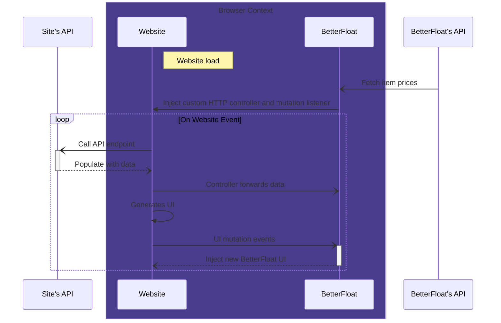

<p align="center">
  <a href="https://betterfloat.com/">
    
  </a>
  <h1 align="center">BetterFloat</h1>
</p>


[](https://github.com/GODrums/BetterFloat/actions/workflows/github-code-scanning/codeql.yml)
[](https://github.com/GODrums/BetterFloat/actions/workflows/lint.yml)


[](https://github.com/GODrums/BetterFloat/blob/main/LICENSE.md)

<p align="center">
  <a href="https://chromewebstore.google.com/detail/betterfloat/bphfhlfhnohppnleaehnlfigkkccpglk">
    <picture>
      <source srcset="https://i.imgur.com/XBIE9pk.png" media="(prefers-color-scheme: dark)">
      </picture></a>
  <a href="https://addons.mozilla.org/en-US/firefox/addon/betterfloat/">
    <picture>
      <source srcset="https://i.imgur.com/ZluoP7T.png" media="(prefers-color-scheme: dark)">
      </picture></a>
  </br></br>
</p>

## 🤝 Community / Support

<p>
We maintain a very active Discord server, where you can share your snipes, ask questions, report bugs, or suggest new features. Join here:
</p>

<p align="center">
  <a href="https://discord.gg/VQWXp33nSW">
    <picture>
      <source srcset="https://i.postimg.cc/Fzj7T05w/discord.png" media="(prefers-color-scheme: dark)">
      </picture></a>
</p>

## 📄 Highlights

Currently supports CSFloat.com, Skinport.com and Skinbid.com, but more sites are coming soon!

-   Unified pricing from Buff163, Steam, YouPin/UU, C5Game, and CSFloat displayed right next to the item
-   Determine market overpay through applied sticker data (% SP) with gradual coloring
-   Get Case Hardened pattern data such as blue percentage or ranking directly
-   See the listing age of an item in a convenient format
-   Auto-refresh in the "Newest Items"-section on CSFloat
-   Advanced currency conversion with support for many different currencies
-   ... and more than 50 other Quality-of-Life features!

⚠️ Please note that we explicitly forbid the use of the extension for illegal activities. This includes but is not limited to using the extension to gain an unfair advantage over other users. We reserve the right to ban users from our services and report them to the respective platforms if they are found to be engaged in illegal activities.

⚠️ The extension is provided under the [CC BY-NC-SA 4.0](https://creativecommons.org/licenses/by-nc-sa/4.0/) license. In particular, this means that you are not allowed to use the extension for commercial purposes. If you are interested in a commercial license, please contact us directly.

## How does BetterFloat work?



## Services

### Chrome Web Store

[](https://chrome.google.com/webstore/detail/bphfhlfhnohppnleaehnlfigkkccpglk)
[](https://chrome.google.com/webstore/detail/bphfhlfhnohppnleaehnlfigkkccpglk)
[](https://chrome.google.com/webstore/detail/bphfhlfhnohppnleaehnlfigkkccpglk)
[](https://chrome.google.com/webstore/detail/bphfhlfhnohppnleaehnlfigkkccpglk)

### Mozillla Add-on

[](https://addons.mozilla.org/en-US/firefox/addon/betterfloat/)


### Troubleshooting on Mozilla Firefox

In some cases, Firefox does not grant extensions the necessary permissions automatically. This can be fixed by following these steps:

1. Open the BetterFloat popup by clicking on the icon in the toolbar
2. Look for a warning symbol in the top bar of the popup
3. Click on the warning symbol and grant the necessary permissions in the newly opened popup of your browser
4. Open the BetterFloat popup again and check if the warning symbol is gone
5. If the warning symbol is still there, please report this issue in our Discord server

## ⌨️ Development

### 💻 The Tech Stack

<div style="display: flex; flex-direction: row; align-items: center; flex-wrap: wrap; gap: 1rem;">


</div>

### Limitations of self-building

Due to cases of abuse and illegal activities, we explicitly forbid the use of our hosted services when building the extension from source. If you want to use all extension features, please set up your own servers or use the official extension from the Chrome Web Store or Mozilla Add-on Store.

### Installation

Prerequisites:

-   Node.js `>=18.16.0`
-   pnpm `>=8.15.0` or npm `>=9.5.0`
-   tsc `>=4.7.0`

Prepare your local setup via the following command:

```bash
pnpm install
# copy the example env file
cp example.env .env
# fill in the required values. To exit VIM use ':wq'
vim .env
```

### Building

Build the extension in development or production mode:

```bash
# development mode (Chrome or Firefox)
pnpm dev
pnpm dev:firefox
# production mode (Chrome or Firefox)
pnpm build
pnpm build:firefox
```

When working with multiple version, the build process may benefit from clean builds. This can be achieved by running the following command before building:

```bash
# careful, this will delete the build folder
pnpm clean
```

### Loading

The built extension will be located in the `build` folder. For each created subversion (browser and manifest version), there will be a seperate subfolder. Load that folder as unpacked extension in your browser or pack it first and then load the packed version

**Chrome:**

-   Go to `chrome://extensions` or `about:addons` and enable developer mode
-   Click on "Load unpacked" and select the `build/{version}` folder

**Firefox:**

-   Go to `about:debugging#/runtime/this-firefox`
-   Click on "Load Temporary Add-on" and select the `build/{version}/manifest.json` file

### Contributing

To contribute to this project, create your own fork of the repository and submit a pull request.
Please follow the [conventional commits](https://www.conventionalcommits.org/en/v1.0.0/) specification (or an equivalent one) and make sure to format your code with [Biome](https://biomejs.dev/). This projects supports the following commands to control code quality:

```bash
pnpm format  # format with Biome, ALT+SHIFT+F in VSCode
pnpm lint  # runs Biome lint
```

Make sure to test your changes extensively on both browsers and include relevant results in your pull request.

## ⚠️ Disclaimer

BetterFloat is developed independently, and is not officially endorsed by or affiliated with CSFloat Inc., Skinport GmbH, or SkinBid ApS in any way. If you are a legal representative of the aforementioned companies and would like this project to be taken down, please contact me directly at legal@rums.dev or on Twitter @rumscsgo.

Built with 🖤 in Munich.
